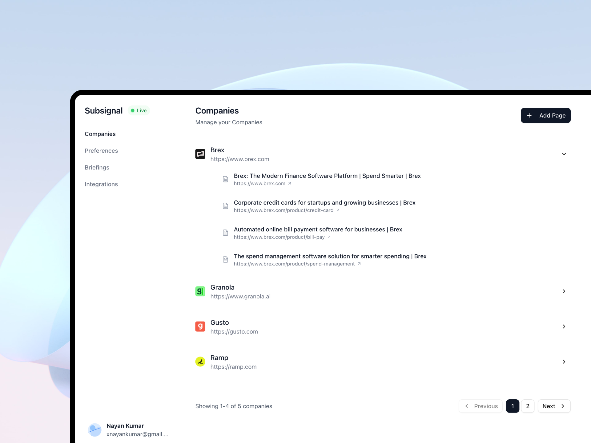
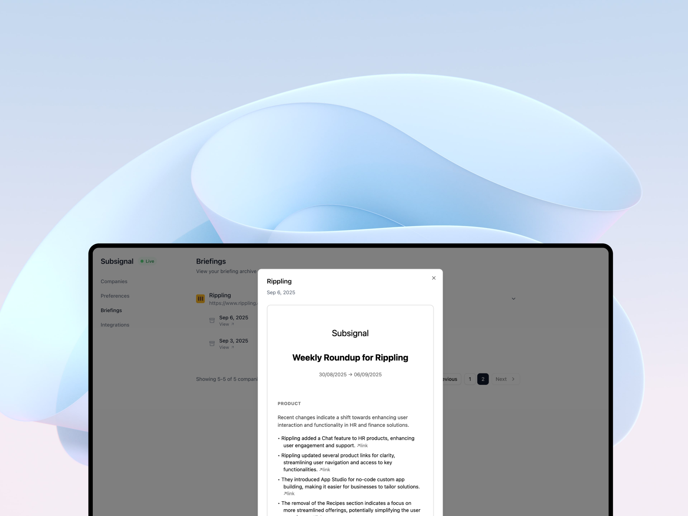
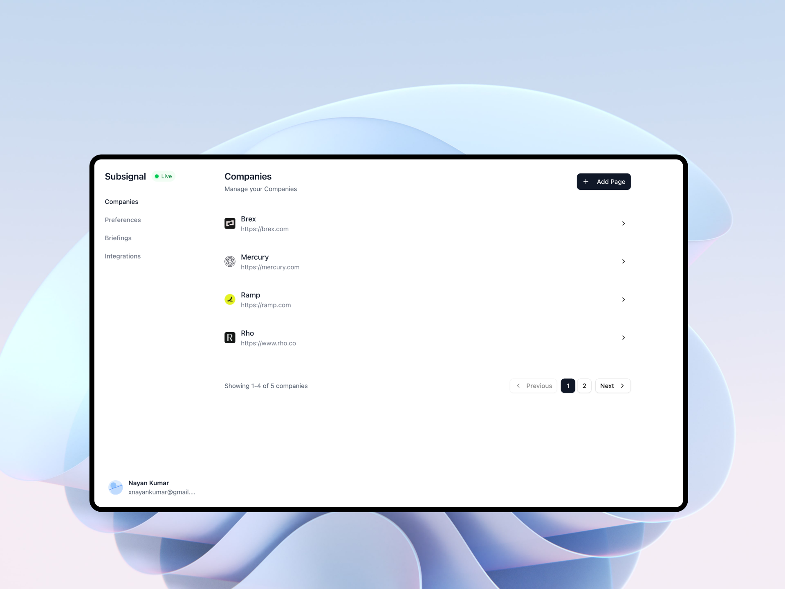
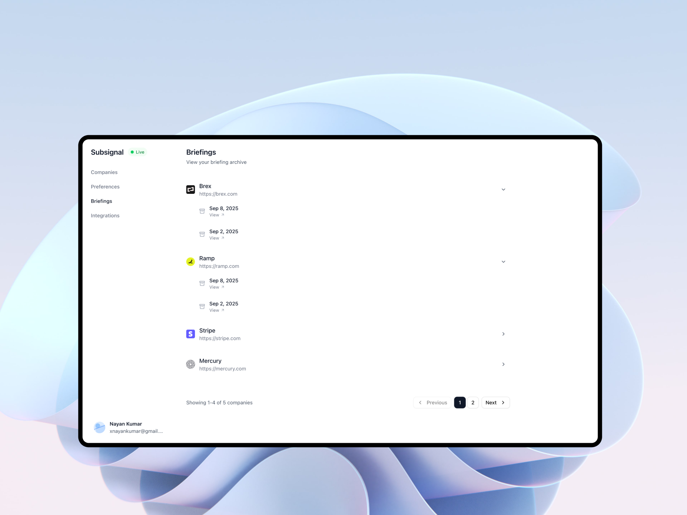
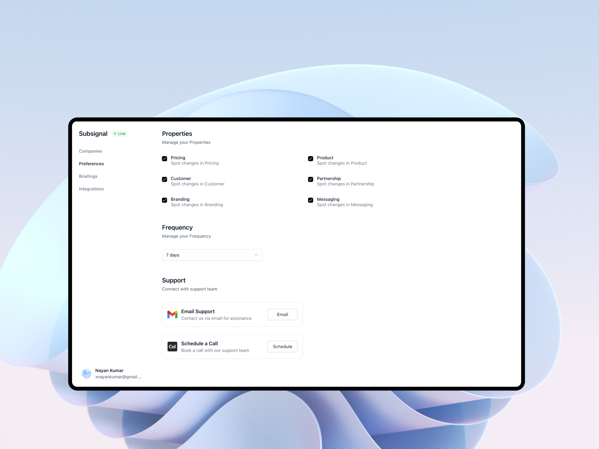
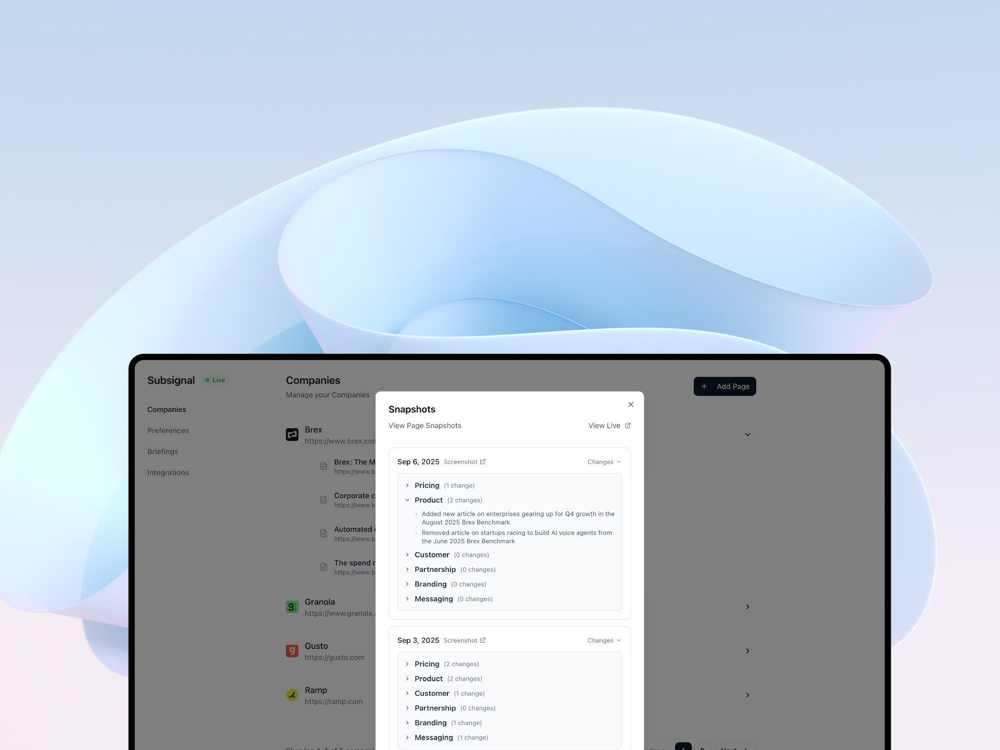
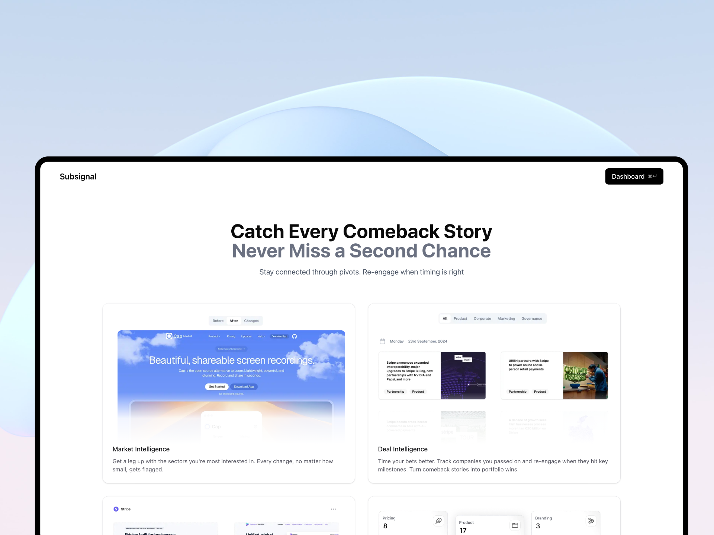

<div align="center">
  <h1>Subsignal</h1>
  <p>Deal Flow Monitoring for VCs</p>
  <p>Never miss a market move. Track comeback stories. Time your bets better.</p>
  <p>
    <a href="https://subsignal.app"><strong>Get Started »</strong></a>
    <a href="https://subsignal.app/pricing"><strong>View Pricing »</strong></a>
  </p>
</div>

<div align="center">
  
</div>

---

## Testimonials

_"We thrive on information asymmetry. Subsignal gives me a leg up with the sectors I'm most interested in. When sector leaders make a move, I'm the first to know."_

_"Look, capital is a commodity, the real value is if you can help founders with market intelligence right when they need it. With Subsignal, I get a front seat view to competitive landscape that others simply don't have."_

_"In venture, relationships are everything. Founders don\'t re-engage once they prove the market, Subsignal helps me plug myself into the conversation. Helping us stay relevant with our would-be portfolio companies."_

## Features

- **Market Intelligence** – Get a leg up with the sectors you're most interested in. Every change, no matter how small, gets flagged.
- **Deal Intelligence** – Time your bets better. Track companies you passed on and re-engage when they hit key milestones. Turn comeback stories into portfolio wins.
- **Relationship Intelligence** – Stay connected through pivots and false starts. Monitor passed opportunities for breakthrough moments. Be the investor they turn to.
- **Competitive Intelligence** – Track competitive threats to your portfolio companies. Whether it's roadmap updates, pricing shifts, or positioning plays, be the first to know.

## Project Structure

```plaintext
subsignal/
├── public/           # Static assets (images, videos, icons, etc.)
├── app/              # Next.js app directory (routes, pages, layouts)
├── components/       # Reusable React components
├── lib/              # Library code (auth, database, utilities)
├── services/         # Business logic and external services
├── hooks/            # Custom React hooks
├── types/            # TypeScript type definitions
├── db/               # Database schema and migrations
├── drizzle/          # Database migration files
├── emails/           # Email templates and components
├── constants/        # Application constants and configuration
├── providers/        # React context providers
├── schema/           # Data validation schemas
├── client/           # Client-side utilities and configurations
├── repository/       # Data access layer
├── payments/         # Payment processing (DodoPayments integration)
├── ingest/           # Data ingestion and processing functions
├── content/          # Static content and documentation
├── docs/             # API documentation and examples
├── .next/            # Next.js build output
├── node_modules/     # Dependencies
├── package.json      # Project metadata and scripts
├── tsconfig.json     # TypeScript configuration
├── drizzle.config.ts # Database configuration
└── README.md         # Project documentation
```

- Most of the application logic and UI lives in the `app/` and `components/` directories.
- Database schema is defined in `db/schema` and managed with Drizzle ORM.
- The `services/` directory contains business logic and external service integrations.
- Email templates are in the `emails/` directory using React Email.

## Getting Started

Thank you for your interest in contributing to Subsignal!

### Prerequisites

- Node.js 18+ and pnpm
- PostgreSQL database
- Various API keys (see Environment Variables section)

### Installation

1. **Clone the repository**

    ```bash
    git clone <repository-url>
    cd subsignal
    ```

2. **Install dependencies**

    ```bash
    pnpm install
    ```

3. **Copy and configure environment variables**

    ```bash
    cp .env.example .env.local
    ```

    Fill in the required values (see Environment Variables section below).

4. **Set up the database**

    ```bash
    pnpm db:generate
    pnpm db:migrate
    ```

5. **Run the development server**
    ```bash
    pnpm dev
    ```

The app will be available at `http://localhost:3000` by default.

### Environment Variables

Create a `.env.local` file in the project root and configure the required environment variables:

```bash
cp .env.example .env.local
```

Key environment variables you'll need:

- **Database**: PostgreSQL connection string
- **Authentication**: Better Auth with Google OAuth credentials
- **AI Services**: OpenAI API key for intelligent briefings
- **Email**: Resend API for automated notifications
- **Storage**: Cloudflare R2 for briefings and screenshots
- **Payments**: DodoPayments integration for subscriptions
- **Background Jobs**: Inngest for scheduled monitoring

See `.env.example` for the complete list with descriptions.

### Development Scripts

- **`pnpm dev`** - Start development server with Turbopack
- **`pnpm build`** - Build the project for production
- **`pnpm start`** - Start production server
- **`pnpm lint`** - Check for linting issues
- **`pnpm typecheck`** - Check TypeScript types
- **`pnpm format`** - Auto-format code with Prettier

### Database Scripts

- **`pnpm db:generate`** - Generate database migrations
- **`pnpm db:migrate`** - Apply database migrations
- **`pnpm db:studio`** - Open Drizzle Studio for database management
- **`pnpm db:push`** - Push schema changes to database
- **`pnpm db:pull`** - Pull schema changes from database

### Additional Development Tools

- **`pnpm email`** - Start React Email development server (port 4040)
- **`pnpm inngest`** - Start Inngest development server
- **`pnpm hookdeck`** - Start Hookdeck tunnel for webhooks

## API Documentation

View the complete API documentation at `docs/example.md` or use the Postman collection at `docs/subsignal.postman_collection.json`.

Base URL: `http://localhost:3000/api` (Development) or `https://subsignal.app/api` (Production)

Key endpoints:

- `/api/auth/*` - Authentication (Better Auth with Google OAuth)
- `/api/v1/companies` - Company management
- `/api/v1/pages` - Page monitoring
- `/api/v1/preferences` - User preferences
- `/api/health` - Health checks

## Tech Stack

- **Frontend**: Next.js 15, React 19, TypeScript, Tailwind CSS
- **Backend**: Hono API framework, PostgreSQL with Drizzle ORM
- **Authentication**: Better Auth with Google OAuth
- **AI**: OpenAI GPT for briefing generation and analysis
- **Email**: React Email with Resend
- **Payments**: DodoPayments integration
- **Background Jobs**: Inngest for monitoring automation
- **Storage**: Cloudflare R2 for briefings and screenshots
- **UI Components**: Radix UI, Lucide React, Sonner toasts

## Contributing

### Code Quality

- Run `pnpm lint` to check for linting issues
- Run `pnpm typecheck` to check TypeScript types
- Run `pnpm format` to auto-format code
- Follow the existing code style and patterns

### Building

- Run `pnpm build` to build the project for production
- Ensure all tests pass and no type errors exist

### Notes

- Do not commit files or folders listed in `.gitignore`
- Use clean and clear code for maintainability
- Follow the existing code style and structure
- Test your changes thoroughly before submitting

## Screenshots

### AI-Powered Briefings

Get intelligent summaries of company changes and market movements delivered directly to your inbox.

<div align="center">
  
</div>

### Company Portfolio Management

Track all your portfolio companies and prospects in one centralized dashboard.

<div align="center">
  
</div>

### Briefing Management

View and organize all your briefings with smart filtering and search capabilities.

<div align="center">
  
</div>

### Monitoring Preferences

Configure what you want to track and how often you want to receive updates.

<div align="center">
  
</div>

### Page Snapshots

Visual comparisons showing exactly what changed on company websites over time.

<div align="center">
  
</div>

### Feature Overview

Comprehensive view of all intelligence features working together to keep you informed.

<div align="center">
  
</div>

## Pricing

Subsignal offers flexible plans for different investment workflows:

- **Solo Plan**: $129/month - Perfect for individual VCs (10 companies, 50 pages)
- **Fund Plan**: $399/month - For investment teams (50 companies, 100 pages)
- **Enterprise**: Custom pricing - Unlimited tracking for large funds
